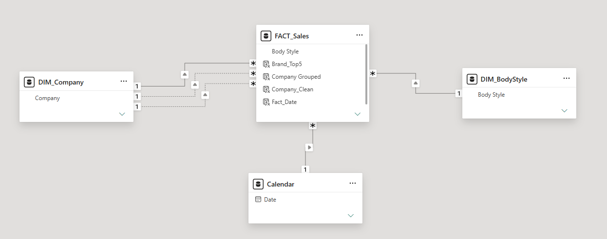

# 🚗 Automotive Sales Dashboard | Power BI

## 📌 Project Overview

The Automotive Sales Dashboard is an end-to-end Business Intelligence solution built in Power BI to analyze sales performance, dealer efficiency, market trends, and customer behavior in the automotive industry.

The project transforms raw transactional data into an interactive analytical solution that supports business decision-making through KPIs, trends, and performance insights.

---

## 🎯 Business Objective

The goal of this project was to answer key business questions:

- How is vehicle sales performance evolving over time?
- Which dealers generate the highest revenue?
- What market segments drive the most sales?
- How do pricing strategies impact market share?
- Who are the most valuable customers?
- Which areas require strategic business actions?

---

## 📊 Dataset

The analysis is based on automotive sales transaction data covering 2022–2023.

The dataset includes approximately **23.9K vehicle sales transactions** and contains information about:

- Vehicle sales transactions
- Dealers and regions
- Vehicle brands and segments
- Customer demographics
- Pricing and revenue data
- Market performance indicators

---

## 🛠️ Tools & Technologies

- Power BI
- Power Query (ETL)
- DAX (Data Analysis Expressions)
- Data Modeling (Star Schema)
- Excel
- Data Visualization & Business Storytelling

---

## 📐 Data Model

The data model follows a Star Schema design optimized for analytical reporting and time intelligence calculations.

The FACT_Sales table contains transactional sales data at the granular level and is connected to supporting dimension tables such as:

* Calendar
* Company
* Body Style

The model enables efficient filtering, KPI calculations, market share analysis, and time intelligence reporting.

---

## 🧮 Key DAX Measures

### Customer Affordability Index

Measures the percentage of customers whose annual income is sufficient to purchase vehicles at the average market price.

### YoY Sales Growth %

Measures year-over-year sales performance using Time Intelligence calculations.

### Market Share %

Calculates the sales contribution of selected brands, dealers, or body styles relative to the total market.

### Pareto Revenue %

Calculates cumulative revenue contribution to identify the dealers generating 80% of total sales.

---

# 📈 Dashboard Structure

## 1️⃣ Report Intro & Navigation
An interactive landing page providing an overview of the report structure, target audience (Executive Management, Sales Directors, Dealer Network Managers), and direct navigation to key analytic sections.

---

## 2️⃣ Sales Overview
High-level view of overall business performance and growth drivers.

**Key KPIs:**
- Total Sales ($671.5M)
- Total Vehicles Sold (23.9K)
- Average Vehicle Price ($28.1K)
- Year-over-Year (YoY) Sales Growth (+123.6%)

**Analysis Included:**
- Monthly sales trends with seasonality patterns
- Sales Growth Drivers: Volume vs. Price analysis
- Top 5 Companies by Sales Value (led by Chevrolet at $47.2M)

---

## 3️⃣ Market Analytics
Market positioning, competitive performance, and brand distribution analysis.

**Key KPIs:**
- Top Dealer Market Share (5.6%)
- Market Average Price ($28K)
- Market Activity Growth (124.6%)

**Analysis Included:**
- Competitive positioning across time periods, dealers, and body styles
- Market Share by Body Style (led by Hatchback at 22.3% and SUV at 20.9%)
- Selected Brand vs. Market Average Price by Body Style

---

## 4️⃣ Customer & Dealer Insights
Analysis of customer demographics, regional performance, and purchasing power.

**Key KPIs:**
- Number of Customers (3,022)
- Cars per Customer (7.9)
- Average Vehicle Price ($28.09K)
- Average Spend per Customer ($222K)

**Analysis Included:**
- Customer Distribution by Gender and Average Annual Income by Gender
- Customer Affordability Index (highlighting that only 3.4% of customers whose annual income allows purchasing offered vehicles)
- Total Sales by Dealer Region (led by Austin at $117.2M)
- Top 5 Dealers by Total Sales

---

## 5️⃣ Dealer Performance Analysis (Regional)
Dealer benchmarking, revenue concentration, and Pareto distribution analysis.

**Key KPIs & Insights:**
- Total Sales ($671.5M)
- Average Sales per Dealer ($24.0M)
- Median Sales per Dealer ($17.7M)
- Top Dealer Revenue Share (5.6%)
- Top 5 Share (27%)
- **Revenue Concentration (Pareto Analysis):** Exactly 21 dealers generate 80% of total sales, indicating a diversified but unevenly distributed performance structure.

---

## 6️⃣ Recommendations
Actionable, data-driven strategies derived directly from report insights:

*   **Insight #1: Very low customer affordability despite high average income**
    *   *Recommendation:* Introduce targeted financing options (e.g., leasing or installments) to improve affordability for customers with limited purchasing power.
    *   *Expected Impact:* +10-15% sales uplift within 6-9 months.
*   **Insight #2: Uneven sales performance among top dealers across regions**
    *   *Recommendation:* Increase marketing support and performance-based incentives for underperforming top dealers to reduce regional sales gaps.
    *   *Expected Impact:* +5-10% total sales increase within 3-6 months.
*   **Insight #3: Suboptimal price-to-market-share positioning within the SUV body style segment**
    *   *Recommendation:* Adjust pricing for SUV models with low market share to improve competitiveness within the segment.
    *   *Expected Impact:* +3-3 pp market share increase within 6-9 months.

---

# 📊 Key Business Insights Summary

- Total sales exceeded **$671.5M** with a massive YoY growth of **+123.6%**.
- Revenue concentration analysis shows a healthy network structure where **21 dealers secure 80% of total revenue**.
- The Hatchback (22.25%) and SUV (20.91%) segments dominate total market share.
- Severe affordability constraint identified: only **3.4%** of target customers can comfortably afford outright vehicle purchases without financing structures.

---

# 🧠 Skills Demonstrated

*   **Data Preparation:** Data cleaning, transformation, and Power Query ETL processing.
*   **Data Modeling:** Fact and dimension table separation utilizing an optimized Star Schema.
*   **DAX & Analytics:** Time intelligence calculations (YoY Growth), dynamic KPI cards, and Pareto revenue concentration formatting.
*   **Data Visualization:** Interactive UX/UI dashboard design, conditional formatting, and strategic business storytelling.

---

# 📷 Dashboard Preview

### Landing Page

### Sales Overview

### Market Analytics

### Customer & Dealer Insights

### Dealer Performance Analysis Drill-Down

### Recommendations

---

## 🔗 Project Links

**Power BI Dashboard:** [https://app.powerbi.com/view?r=eyJrIjoiYTUwMjIwZWItNTJlYy00N2Q3LTljODctZjg1MTliZDg5Mzg1IiwidCI6IjNkZmU5YWI2LTgxYmYtNDkxYy1iNjcwLTAxYzgyNGEwOWUxOSJ9]

**GitHub Repository:** [https://github.com/katarzyna-miechowska-bi/automotive-sales-dashboard]

---

## 📬 Contact

Feel free to connect with me on LinkedIn to discuss this project or opportunities in Data Analytics / Business Intelligence.

---

## ⭐ Portfolio Project

This project demonstrates an end-to-end Business Intelligence workflow, from raw data processing and modeling to interactive dashboard development and business insights generation.
