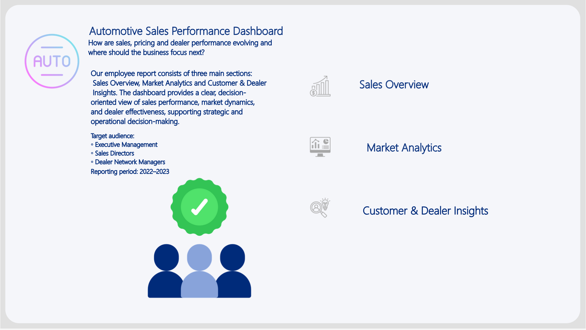
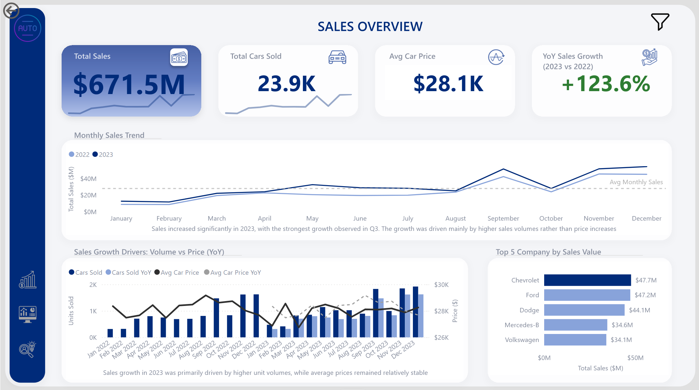
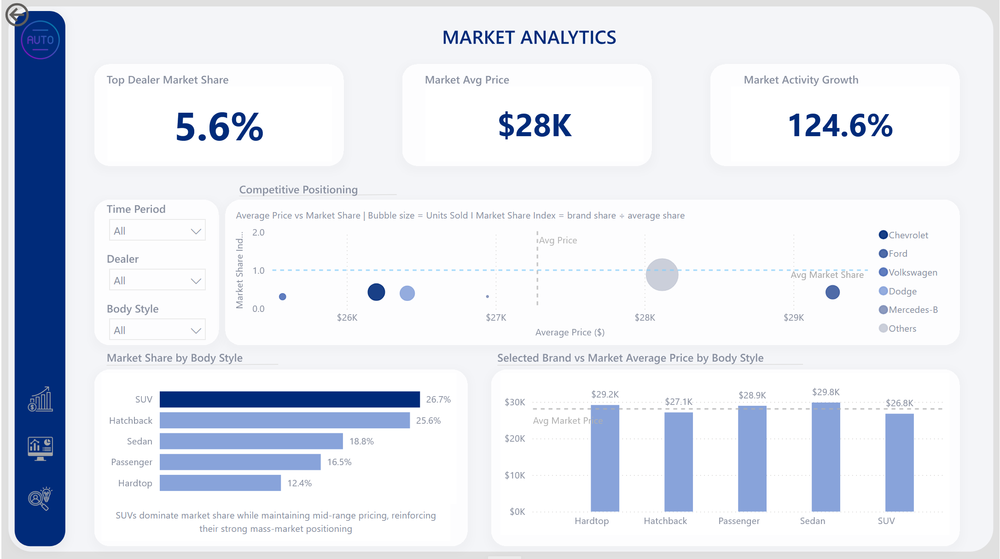
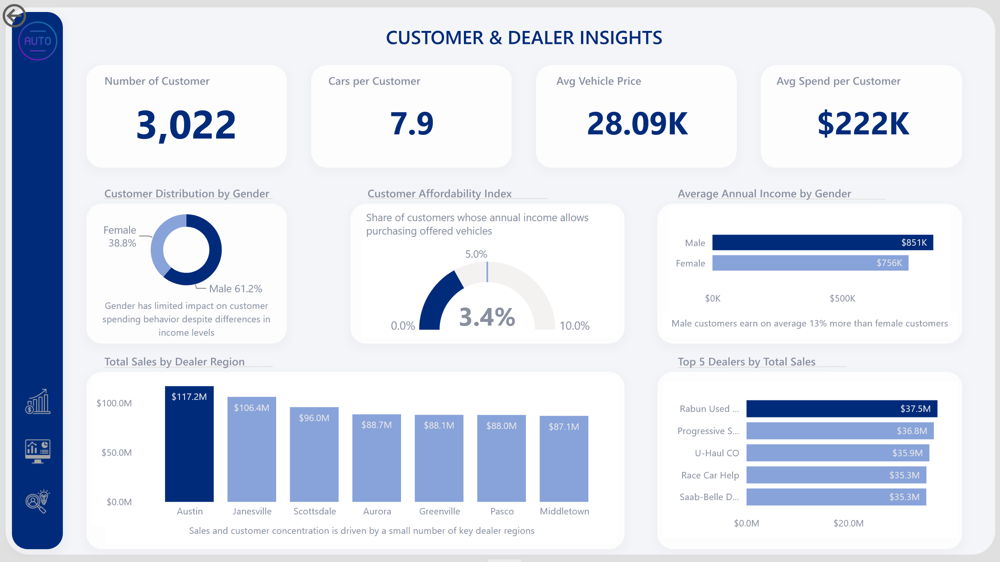
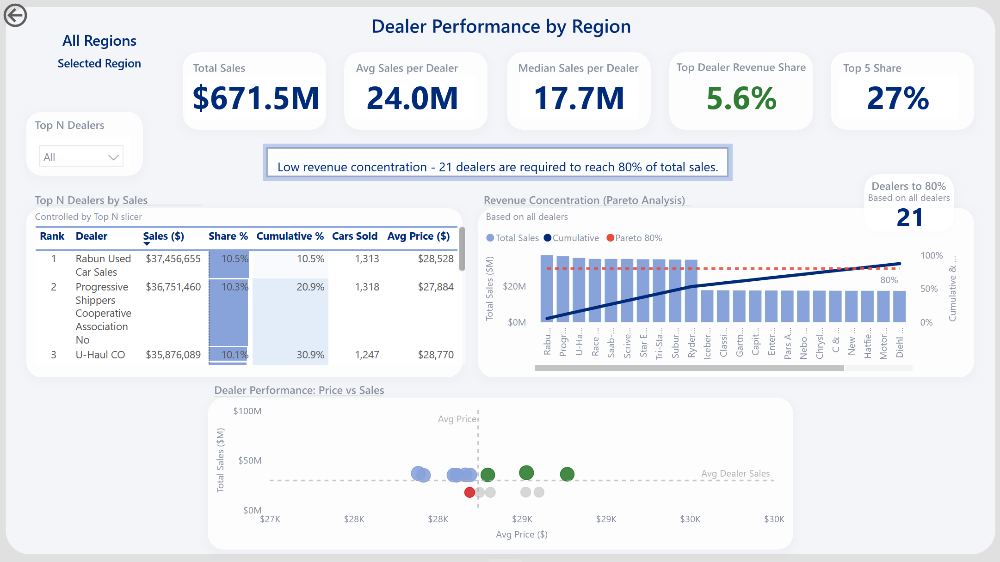
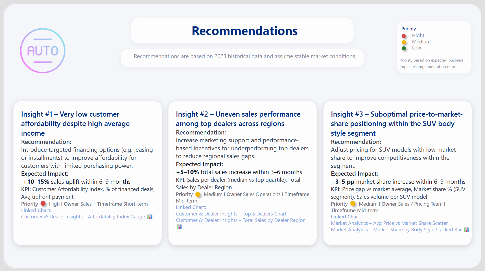

# 🚗 Automotive Sales Dashboard | Power BI

## 📌 Project Overview

The Automotive Sales Dashboard is an end-to-end Business Intelligence project built in Power BI to analyze sales performance, dealer efficiency, market trends, and customer behavior in the automotive industry.

The project transforms raw transactional data into an interactive analytical solution that supports business decision-making through KPIs, trends, and performance insights.

---

## 🎯 Business Objective

The goal of this project was to answer key business questions:

- How is vehicle sales performance evolving over time?
- Which dealers generate the highest revenue?
- What market segments drive the most sales?
- How do pricing strategies impact market share?
- Who are the most valuable customers?
- Which areas require strategic business actions?

---

## 📊 Dataset

The analysis is based on automotive sales transaction data covering 2022–2023.

The dataset includes approximately **23.9K vehicle sales transactions** and contains information about:

- Vehicle sales transactions
- Dealers and regions
- Vehicle brands and segments
- Customer demographics
- Pricing and revenue data
- Market performance indicators

---

## 🛠️ Tools & Technologies

- Power BI
- DAX
- Power Query
- Data Modeling
- Excel
- Data Visualization
- Business Intelligence

---

## 📈 Dashboard Structure

### 1️⃣ Sales Overview

High-level view of overall business performance.

**Key KPIs:**
- Total Sales
- Total Vehicles Sold
- Average Vehicle Price
- Year-over-Year (YoY) Growth

**Analysis:**
- Monthly sales trends
- Seasonality patterns
- Top manufacturers by revenue
- Price vs volume relationship

---

### 2️⃣ Market Analytics

Market positioning and competitive performance analysis.

**Key KPIs:**
- Market Share by Dealers
- Average Market Price
- Market Growth

**Analysis:**
- Brand positioning
- Segment performance (SUV, Sedan, etc.)
- Market share distribution
- Pricing impact on competitiveness

---

### 3️⃣ Customer & Dealer Insights

Analysis of customer base and regional performance.

**Key KPIs:**
- Number of Customers
- Average Customer Income
- Average Spend per Customer
- Cars per Customer

**Analysis:**
- Customer demographics breakdown
- Regional sales performance
- Dealer ranking
- Customer behavior patterns

---

### 4️⃣ Dealer Performance Analysis

Dealer benchmarking and revenue concentration analysis.

**Key Insights:**
- Dealer ranking by revenue
- Performance comparison across regions
- Sales vs pricing analysis
- Market share contribution

**Business Insight:**
Approximately **21 dealers generate 80% of total revenue**, indicating a diversified but unevenly distributed performance structure across the network.

This suggests reduced dependency on a small group of top-performing dealers, but highlights opportunities for optimization among mid-tier dealers.

---

### 5️⃣ Business Recommendations

Data-driven recommendations based on analytical findings:

**Insight 1:**
Customer affordability is not fully aligned with income levels.
→ Recommendation: introduce financing and leasing options.

**Insight 2:**
Uneven performance across dealers and regions.
→ Recommendation: improve dealer support and performance monitoring.

**Insight 3:**
Pricing inefficiencies in selected segments.
→ Recommendation: optimize pricing strategy to improve competitiveness and market share.

---

## 📊 Key Business Insights

- Total sales exceeded **$671M**
- Strong year-over-year growth in vehicle sales
- SUV segment represented the largest market share
- Sales show clear seasonal patterns
- Top manufacturers dominate revenue distribution
- Customer base shows high income but moderate purchasing efficiency
- Dealer performance varies significantly across regions

---

## 🧠 Skills Demonstrated

### Data Preparation
- Data cleaning and transformation
- Handling missing and inconsistent data
- Power Query ETL processes

### Data Modeling
- Star schema design
- Relationship building
- Fact and dimension tables

### DAX & Analytics
- Time intelligence calculations
- YoY growth measures
- KPI development
- Dynamic calculations

### Data Visualization
- Interactive dashboard design
- KPI reporting
- Business storytelling

### Business Analysis
- Trend analysis
- Customer segmentation
- Market analysis
- Dealer performance evaluation
- Strategic recommendations

---

## 📷 Dashboard Preview

### Overview Dashboard

### Sales Analysis

### Market Analysis

### Customer Insights

### Dealer Performance Drill-Down

### Recommendations

---

## 🔗 Project Links

**Power BI Dashboard:** https://app.powerbi.com/view?r=eyJrIjoiYTUwMjIwZWItNTJlYy00N2Q3LTljODctZjg1MTliZDg5Mzg1IiwidCI6IjNkZmU5YWI2LTgxYmYtNDkxYy1iNjcwLTAxYzgyNGEwOWUxOSJ9

**GitHub Repository:** https://github.com/katarzyna-miechowska-bi/automotive-sales-dashboard

---

## 📬 Contact

Feel free to connect with me on LinkedIn to discuss this project or opportunities in Data Analytics / Business Intelligence.

---

## ⭐ Portfolio Project

This project demonstrates an end-to-end Business Intelligence workflow, from raw data processing and modeling to interactive dashboard development and business insights generation.
